 # Benchmark entre bcl2fastq et bcl-convert 

<!-- vscode-markdown-toc -->
* 1. [Différences d'utilisation entre bcl2fastq et bcl-convert](#Diffrencesdutilisationentrebcl2fastqetbcl-convert)
* 2. [Résultats test bcl2fastq (variation du paramètre p avec r = 4 et w = 4)](#Rsultatstestbcl2fastqvariationduparamtrepavecr4etw4)
	* 2.1. [Tableau des performance de bcl2fastq](#Tableaudesperformancedebcl2fastq)
	* 2.2. [Graphiques des performances de bcl2fastq](#Graphiquesdesperformancesdebcl2fastq)
		* 2.2.1. [Temps total](#Tempstotal)
		* 2.2.2. [Temps cpu](#Tempscpu)
		* 2.2.3. [Barplot cummulé des deux run de JARVIS (NovaSeq 6000)](#BarplotcummuldesdeuxrundeJARVISNovaSeq6000)
* 3. [Résultats test bcl2fastq (variation du paramètre r et w avec p = 12)](#Rsultatstestbcl2fastqvariationduparamtreretwavecp12)
	* 3.1. [Tableau des performance de bcl2fastq](#Tableaudesperformancedebcl2fastq-1)
	* 3.2. [Graphiques des performances de bcl2fastq](#Graphiquesdesperformancesdebcl2fastq-1)
		* 3.2.1. [Temps total](#Tempstotal-1)
		* 3.2.2. [Temps cpu](#Tempscpu-1)
		* 3.2.3. [Barplot cummulé des deux run de JARVIS (NovaSeq 6000)](#BarplotcummuldesdeuxrundeJARVISNovaSeq6000-1)
* 4. [Résultats test bcl2fastq (variation du paramètre p, r et w)](#Rsultatstestbcl2fastqvariationduparamtrepretw)
	* 4.1. [Tableau des performance de bcl2fastq](#Tableaudesperformancedebcl2fastq-1)
	* 4.2. [Graphiques des performances de bcl2fastq](#Graphiquesdesperformancesdebcl2fastq-1)
		* 4.2.1. [Temps total](#Tempstotal-1)
		* 4.2.2. [Temps cpu](#Tempscpu-1)
		* 4.2.3. [Barplot cummulé des deux run de JARVIS (NovaSeq 6000)](#BarplotcummuldesdeuxrundeJARVISNovaSeq6000-1)
* 5. [Résultats test bcl2fastq (variation du paramètre r et w avec p = 8)](#Rsultatstestbcl2fastqvariationduparamtreretwavecp8)
	* 5.1. [Tableau des performance de bcl2fastq](#Tableaudesperformancedebcl2fastq-1)
	* 5.2. [Graphiques des performances de bcl2fastq](#Graphiquesdesperformancesdebcl2fastq-1)
		* 5.2.1. [Temps total](#Tempstotal-1)
		* 5.2.2. [Temps cpu](#Tempscpu-1)
		* 5.2.3. [Barplot cummulé des deux run de JARVIS (NovaSeq 6000)](#BarplotcummuldesdeuxrundeJARVISNovaSeq6000-1)
* 6. [Tableau récapitulatif des résultats obtenus pour bcl2fastq](#Tableaurcapitulatifdesrsultatsobtenuspourbcl2fastq)
	* 6.1. [MELISSE](#MELISSE)
	* 6.2. [JARVIS](#JARVIS)
* 7. [Résultats de bcl-convert](#Rsultatsdebcl-convert)
	* 7.1. [Tableau des performance de bcl2fastq (p = r = w)](#Tableaudesperformancedebcl2fastqprw)
	* 7.2. [Graphiques des performances de bcl-convert](#Graphiquesdesperformancesdebcl-convert)
* 8. [Comparaison bcl2fastq et bcl-convert](#Comparaisonbcl2fastqetbcl-convert)
	* 8.1. [Comparaison du temps total](#Comparaisondutempstotal)
	* 8.2. [Comparaison du tems cpu](#Comparaisondutemscpu)
	* 8.3. [Comparaison du pourcentage d'utilisation des cpu](#Comparaisondupourcentagedutilisationdescpu)
	* 8.4. [Tableau comparatif entre bcl2fastq et bcl-convert](#Tableaucomparatifentrebcl2fastqetbcl-convert)
* 9. [Comparaison des performance en utilisant le paramètre du nombre de tâches en paralèlles](#Comparaisondesperformanceenutilisantleparamtredunombredetchesenparallles)
	* 9.1. [Tableau](#Tableau)
	* 9.2. [Graphiques](#Graphiques)
		* 9.2.1. [p = w = r = nb de coeurs](#pwrnbdecoeurs)
		* 9.2.2. [P = nb de coeurs et r = w = 4](#Pnbdecoeursetrw4)
	* 9.3. [utilisation du nombre de tâches à effectuer en paralèlles](#utilisationdunombredetcheseffectuerenparallles)
* 10. [Différences d'arborescence entre bcl2fastq et bcl-convert](#Diffrencesdarborescenceentrebcl2fastqetbcl-convert)
	* 10.1. [Commande pour lancé bcl2fastq](#Commandepourlancbcl2fastq)
	* 10.2. [Exemple d'arborescence de bcl2fastq](#Exempledarborescencedebcl2fastq)
	* 10.3. [Commande de bcl-convert](#Commandedebcl-convert)
	* 10.4. [exemple d'arborescence de bcl-convert](#exempledarborescencedebcl-convert)
* 11. [Description des sorties de bcl-convert](#Descriptiondessortiesdebcl-convert)

<!-- vscode-markdown-toc-config
	numbering=true
	autoSave=true
	/vscode-markdown-toc-config -->
<!-- /vscode-markdown-toc -->

Ce document à pour objectif de comparer les différences entre le logiciel de "_base calling_" bcl2fastq et BCL convert, qui sont des locgiciels de "_base calling_" conçue par illumina pour leurs séquenceurs.  

---
---

##  1. Différences d'utilisation entre bcl2fastq et bcl-convert

__bcl2fastq :__  
Options utilisées en ligne de commande :  
`--inputdir` ==> path des fichier BCL  
`--min-log-level` ==>  
`--barcode-mismatches` ==> nombre de mismatches acceptés sur les index  
`--runfolder-dir` ==> path du répertoire où le run à été effectué  
`--output-dir` ==> path du répertoire de sortie des fichiers générés par bcl2fastq (dont les FASTQ)  
`--use-base-mask` ==> indique le nobre de bases pris en compte pour les index  
`-r` ==> nombre de coeurs alloués en lecture (fichiers BCL)  
`-p` ==> nombre de coeurs alloués pour le processus de bcl2fastq  
`-w` ==> nombre de coeurs alloués en ecriture (FASTQ)  
`-d` ==> nombre de coeurs alloués pour le démultipléxage  

Autres options :  
`--sample-sheet` ==> path de la sample sheet (par défaut : <`runfolder-dir`>/SampleSheet.csv)  

Options de bcl2fasq dans les fichiers SampleSheet (seul le format V1 est accepté) :  
Data section :  
`Lane`  
`Sample_ID`  
`Sample_name`  
`Sample_plate`  
`Sample_well`  
`I7_index_ID`
`index`  
`ìndex2`  
`Sample_Project`  
`Description`  

__bcl-convert :__  
Option utilisées en ligne de commande :  
`--bcl-input-directory` ==> path du répertoire où le run à été effectué   
`--output-directory` ==> path du répertoire de sortie des fichiers générés par bcl-convert. cette option est obligatoire et le répertoire spécifié ne doit pas exister. (si le répertoire existe alors il faut utiliser `--force` / `-f` en plus)  
`--sample-sheet` ==> path de la sample sheet (oblgatoire, par défaut : <`--bcl-input-directory`>/SampleSheet.csv)  
Option non mentionnées dans la doc de bcl-convert :  
`--bcl-sampleproject-subdirectories` ==> création de sous-répertoires Sample_ Project comme spécifié dans la SampleSheet  
`--bcl-num-decompression-threads` ==> nombre de coeurs alloués en lecture (fichiers BCL)  
`--bcl-num-conversion-threads` ==> nombre de coeurs alloués pour le processus de bcl2fastq  
`--bcl-num-compression-threads` ==> nombre de coeurs alloués en ecriture (FASTQ)  
`--bcl-num-parallel-tiles` ==>  nombre de tâche effectuer en parallèle  

Option de bcl-convert dans les fichiers SampleSheet (formats V1 et V2 acceptés) :  
Data section (comme pour bcl2fastq):  
`Lane`  
`Sample_ID`  
`index`  
`ìndex2`  
`Sample_Project`  
Settings section :  
`BarcodeMismatchesIndex1`  
`BarcodeMismatchesIndex2`  
`OverrideCycles`  

__Différences d'utilisations en ligne de commande (utilisé actuellement) :__  
| bcl2fastq | bcl-convert | changement utilisation |
|---|---|---|
| `--inputdir` | None | Inpossible de spécifier le path des BaseCalls |
| `--min-log-level` | ? | ? |
| `--barcode-mismatches` | None | À mettre dans la Sample Sheet (dans la partie settings ==> `BarcodeMismatchesIndex1` / `BarcodeMismatchesIndex2`)| 
| `--runfolder-dir` | `--bcl-input-directory` | même utilisation  |
| `--output-dir` | `--output-directory` | même utilisation, mais devient obligatoire (utiliser `--force`/`-f` si le rep de sortie existe déjà) |
| `--sample-sheet` | `--sample-sheet` | même utilisation |
| `--use-base-mask` | None | À mettre dans la Sample Sheet (dans la partie settings ==> `OverrideCycles`) |
| `-r` | `--bcl-num-decompression-threads` | même utilisation |
| `-p` | `--bcl-num-conversion-threads` | même utilisation |
| `-w` | `--bcl-num-compression-threads` | même utilisation |
| None | `--bcl-num-parallel-tiles` | spécifier le nombre de tâche à efectuer en parallèle
---
---

##  2. Résultats test bcl2fastq (variation du paramètre p avec r = 4 et w = 4)

###  2.1. Tableau des performance de bcl2fastq

| bcl2fastq |||||
|---|---|---|---|---|
| MELISSE |
| param utilisé | temps écoulé (h) | temps cpu |  utilisation cpu (%) | mémoire utilisé (Gb) |
| p4 w4 r4 | 00:00:12.47 | 40.38 | 80.95 | 2.346448 |
| p8 w4 r4 | 00:00:07.59 | 43.18 | 71.12 | 2.361540 |
| p12 w4 r4 | 00:00:06.45 | 43.21 | 55.75 | 2.386592 |
| p16 w4 r4 | 00:00:11.31 | 62.62 | 34.56 | 2.365040 |
| JARVIS |
| param utilisé | temps écoulé (h) | temps cpu |  utilisation cpu (%) | mémoire utilisé (Gb) |
| p4 w4 r4 | 10:48:31 + 11:35:17 | 154644.12 + 161789.16 | 99.25 + 96.75 | 12.459632 + 26.311436 |
| p8 w4 r4 | 05:48:32 + 06:13:34  | 165298.55 + 170323.1 | 98.75 + 94.88 | 12.226456 + 29.826448 |
| p12 w4 r4 | 04:04:10 + 04:36:05 | 172296.87 + 182714.38 | 98.00 + 91.83 | 10.649516 + 35.187044 |
| p16 w4 r4 | 02:58:41 + 05:51:39 | 167139.05 + 314416.25 | 97.38 + 93.13 | 11.353516 + 43.053008 |

###  2.2. Graphiques des performances de bcl2fastq

####  2.2.1. Temps total
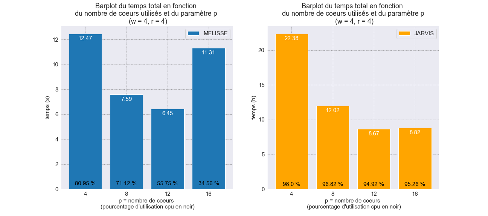 

####  2.2.2. Temps cpu
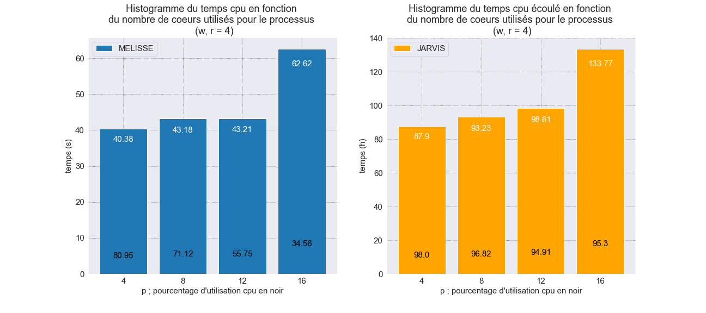  

####  2.2.3. Barplot cummulé des deux run de JARVIS (NovaSeq 6000)
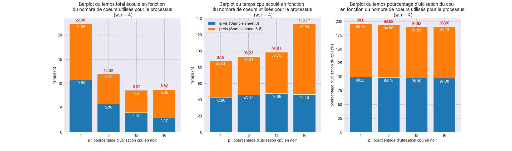

##  3. Résultats test bcl2fastq (variation du paramètre r et w avec p = 12)  
###  3.1. Tableau des performance de bcl2fastq
| bcl2fastq |||||
|---|---|---|---|---|
| MELISSE |
| param utilisé | temps écoulé (h) | temps cpu (s) |  utilisation cpu (%) |mémoire utilisé (Gb) |
| p12 r4 w4 | 00:00:08.58 | 57.98 | 56.25 | 2.360844 |
| p12 r8 w8 | 00:00:18.38 | 58.11 | 26.33 | 2.354396 |
| p12 r12 w12 | 00:00:07.51 | 57.26 | 63.50 | 2.359704 |
| JARVIS |
| param utilisé | temps écoulé (h) | temps cpu (s) |  utilisation cpu (%) |mémoire utilisé (Gb) |
| p12 r4 w4 | 04:04:10 + 04:36:05 | 172296.87 + 182714.38 | 98.00 + 91.83 | 10.649516 +  35.187044 |
| p12 r8 w8 | 03:57:35 + 04:38:53 | 168491.81 + 187202.29 | 98.42 + 93.17 | 12.122880 + 37.427376 |
| p12 r12 w12 | 04:01:35 + 04:34:25 | 171504.55 + 183624.04 | 98.58 + 92.92 | 11.171612 + 38.953616 |  

###  3.2. Graphiques des performances de bcl2fastq

####  3.2.1. Temps total
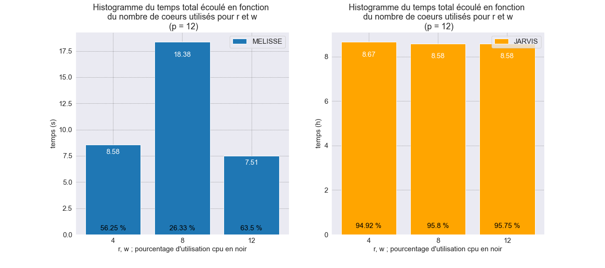 

####  3.2.2. Temps cpu
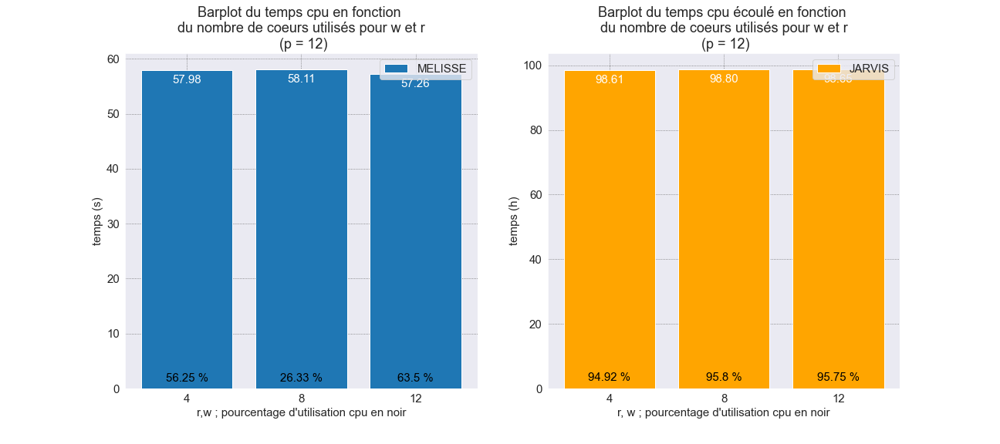  

####  3.2.3. Barplot cummulé des deux run de JARVIS (NovaSeq 6000)

##  4. Résultats test bcl2fastq (variation du paramètre p, r et w)

###  4.1. Tableau des performance de bcl2fastq

| bcl2fastq |||||
|---|---|---|---|---|
| MELISSE |
| param utilisé | temps écoulé (h) | temps cpu |  utilisation cpu (%) |mémoire utilisé (Gb) |
| p4 r4 w4 | 00:00:12.47 | 40.38 | 80.95 | 2.346448 |
| p8 r8 w8 | 00:00:34.75 | 51.98 | 18.63 | 1.869064 |
| p12 r12 w12 | 00:00:07.51 | 57.30 | 63.50 | 2.359704 |
| p16 r16 w16 | 00:00:08.02 | 60.47 | 49.19 | 2.360132 |
| JARVIS |
| param utilisé | temps écoulé (h) | temps cpu |  utilisation cpu (%) |mémoire utilisé (Gb) |
| p4 r4 w4 | 10:21:47 + 16:42:32 | 148369.72 + 215649.95 | 99.20 + 89.50 | 10.226312 + 22.814680 |
| p8 r8 w8 | 05:40:55 + 06:51:09 | 160477.90 + 174911.9 | 98.00 + 88.63 | 10.509808 + 30.503808 |
| p12 r12 w12 | 04:01:35 + 04:34:25 | 171504.55 + 183624.04 | 98.58 + 92.92 | 11.171612 + 38.953616 |
| p16 r16 w16 | 03:24:32 + 03:40:24 | 165158.86 + 181473.41 | 84.06 + 85.75 | 11.793640 + 44.042212 |

###  4.2. Graphiques des performances de bcl2fastq

####  4.2.1. Temps total
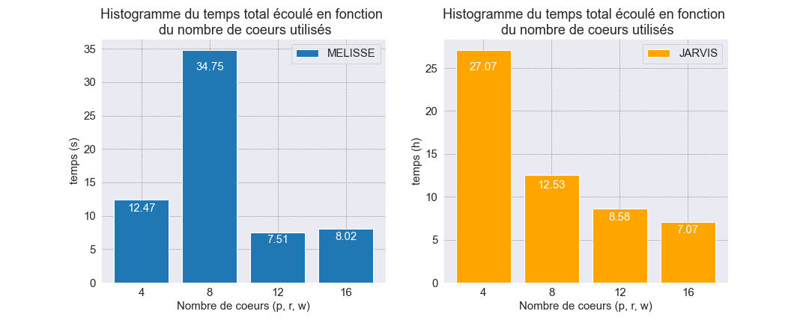 

####  4.2.2. Temps cpu
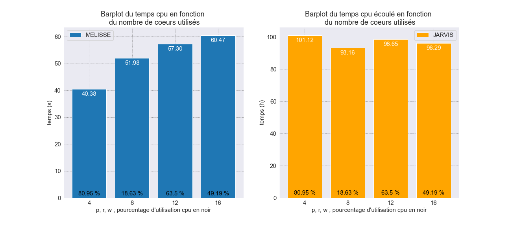 

####  4.2.3. Barplot cummulé des deux run de JARVIS (NovaSeq 6000)
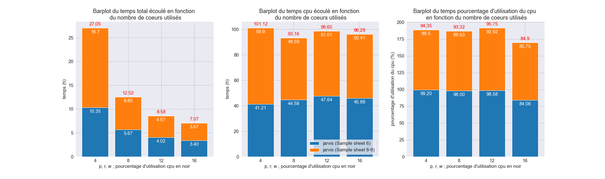

##  5. Résultats test bcl2fastq (variation du paramètre r et w avec p = 8)

###  5.1. Tableau des performance de bcl2fastq

| bcl2fastq |||||
|---|---|---|---|---|
| MELISSE |
| param utilisé | temps écoulé (h) | temps cpu |  utilisation cpu (%) |mémoire utilisé (Gb) |
| p8 r2 w2 | 00:00:36.49 | 53.16 | 18.13 | 1.872452 |
| p8 r4 w4 | 00:00:07.59 | 43.18 | 71.00 | 2.361540 |
| p8 r6 w6 | 00:00:08.55 | 50.79 | 74.25 | 2.346620 |
| p8 r8 w8 | 00:00:34.75 | 51.98 | 18.63 | 1.869064 |
| JARVIS |
| param utilisé | temps écoulé (h) | temps cpu |  utilisation cpu (%) |mémoire utilisé (Gb) |
| p8 r2 w2 | 05:56:38 + 06:50:56 | 167567.71 + 188531.43 | 97.88 + 95.5 | 10.172972 + 27.979624 |
| p8 r4 w4 | 05:48:32 + 06:13:34 | 165298.55 + 170323.10 | 98.75 + 94.88 | 12.226456 + 29.826448 |
| p8 r6 w6 | 05:54:49 + 06:31:55 | 167594.55 + 180114.75 | 98.38 + 95.63 | 10.559480 + 30.853492 |
| p8 r8 w8 | 05:40:55 + 06:51:09 | 160477.90 + 174911.90 | 98.0 + 88.63 | 10.509808 + 30.503808 |

###  5.2. Graphiques des performances de bcl2fastq

####  5.2.1. Temps total
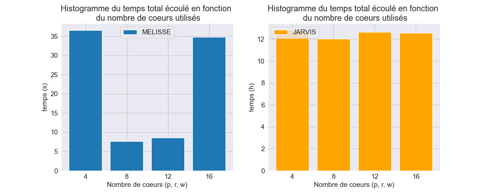 

####  5.2.2. Temps cpu
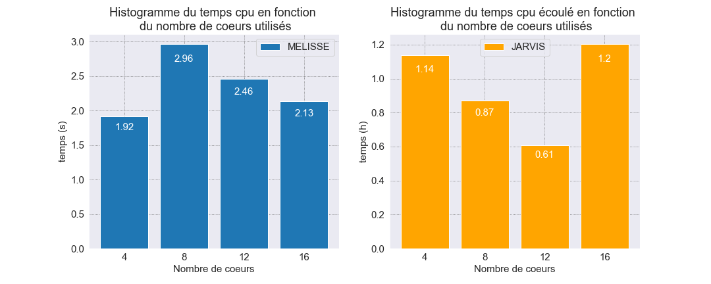  

####  5.2.3. Barplot cummulé des deux run de JARVIS (NovaSeq 6000)
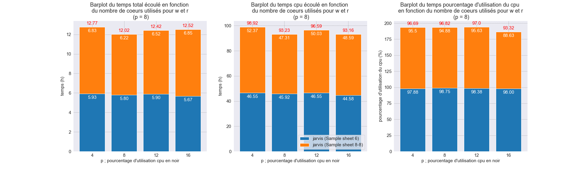

---

##  6. Tableau récapitulatif des résultats obtenus pour bcl2fastq
###  6.1. MELISSE

|type run|param utilisé|temps écoulé (h : m : s)|temps cpu (h : m : s)| utilisation cpu (%)|mémoire utilisé (Gb)|
| --- | --- | --- | --- | --- | --- |
| MELISSE | p4 w4 r4 | 00:00:12.47 | 00:00:40 | 80.95 | 2.346448 |
| MELISSE | p8 w4 r4 | 00:00:07.59 | 00:00:43 | 71.12 | 2.361540 |
| MELISSE | p12 w4 r4 | 00:00:06.45 | 00:00:43 | 55.75 | 2.386592 |
| MELISSE | p16 w4 r4 | 00:00:11.31 | 00:01:02 | 34.56 | 2.365040 |
| MELISSE | p12 r8 w8 | 00:00:18.38 | 00:00:58 | 26.33 | 2.354396 |
| MELISSE | p8 r8 w8 | 00:00:34.75 | 00:00:51 | 18.63 | 1.869064 |
| MELISSE | p12 r12 w12 | 00:00:07.51 | 00:00:57 | 63.50 | 2.359704 |
| MELISSE | p16 r16 w16 | 00:00:08.02 | 00:01:00 | 49.19 | 2.360132 |
| MELISSE | p8 r2 w2 | 00:00:36.49 | 00:00:53 | 18.13 | 1.872452 |
| MELISSE | p8 r6 w6 | 00:00:08.55 | 00:00:50 | 74.25 | 2.346620 |

###  6.2. JARVIS

| type run | param utilisé | temps écoulé (h : m : s) | temps cpu (h : m : s) |  utilisation cpu (%) | mémoire utilisé (Gb) | 
| --- | --- | --- | --- | --- | --- |
| JARVIS | p4 w4 r4 | 10:48:31 + 11:35:17 | 42:57:24 + 44:56:29 | 99.25 + 96.75 | 12.459632 + 26.311436 |
| JARVIS | p8 w4 r4 | 05:48:32 + 06:13:34  | 45:54:58 + 47:18:43 | 98.75 + 94.88 | 12.226456 + 29.826448 |
| JARVIS | p12 w4 r4 | 04:04:10 + 04:36:05 | 47:51:36 + 50:45:14 | 98.00 + 91.83 | 10.649516 + 35.187044 |
| JARVIS | p16 w4 r4 | 02:58:41 + 05:51:39 | 46:25:39 + 87:20:16 | 97.38 + 93.13 | 11.353516 + 43.053008 |
| JARVIS | p12 r8 w8 | 03:57:35 + 04:38:53 | 46:48:11 + 52:00:02 | 98.42 + 93.17 | 12.122880 + 37.427376 |
| JARVIS | p8 r8 w8 | 05:40:55 + 06:51:09 | 44:34:37 + 48:35:11 | 98.00 + 88.63 | 10.509808 + 30.503808 |
| JARVIS | p12 r12 w12 | 04:01:35 + 04:34:25 | 47:38:24 + 51:00:24 | 98.58 + 92.92 | 11.171612 + 38.953616 |
| JARVIS | p16 r16 w16 | 03:24:32 + 03:40:24 | 45:52:38 + 50:24:33 | 84.06 + 85.75 | 11.793640 + 44.042212 |
| JARVIS | p8 r2 w2 | 05:56:38 + 06:50:56 | 46:32:47 + 52:22:11 | 97.88 + 95.5 | 10.172972 + 27.979624 |
| JARVIS | p8 r6 w6 | 05:54:49 + 06:31:55 | 46:33:14 + 50:01:54 | 98.38 + 95.63 | 10.559480 + 30.853492 |

***

| bcl2fastq : Somme des parramètres pour le nombre de coeurs |||||
|---|---|---|---|---|
| JARVIS |
| param utilisé | temps écoulé (h) | temps cpu | utilisation cpu (%) | mémoire utilisé (Gb) |
| c28 p12 r8 w8 | 03:46:19 + 04:23:50 | 154089.97 + 166287.98 | 40.50 + 37.50 | 10.811548 + 37.494200 |
| c20 p12 r4 w4 | 03:35:04 + 04:12:16 | 132959.17 + 148482.30 | 51.50 + 49.0 | 10.508500 | 36.604624 |
| c24 p8 r8 w8 | sortie du chrono vide |  |  |  |  |
| c16 p8 r4 w4 | sortie du chrono vide |  |  |  |  |

---
---

##  7. Résultats de bcl-convert

###  7.1. Tableau des performance de bcl2fastq (p = r = w)

|type run|param utilisé|temps écoulé (h)|temps cpu|utilisation cpu (%)|mémoire utilisé (Gb)|
|---|---|---|---|---|---|
|JARVIS|p8 r8 w8|04:03:46 + 04:01:15|81043.66 + 86491.64|69.25 + 74.63|13.563916 + 22.383716|
|JARVIS|p12 r12 w12|02:54:04 + 02:56:50|96397.79 + 108461.85|76.83 + 85.17|16.297744 + 24.742460|
|JARVIS|p16 r16 w16|02:43:45 + 02:28:32|99892.88 + 85732.81|63.5 + 60.06|15.500356 + 20.536340|

###  7.2. Graphiques des performances de bcl-convert
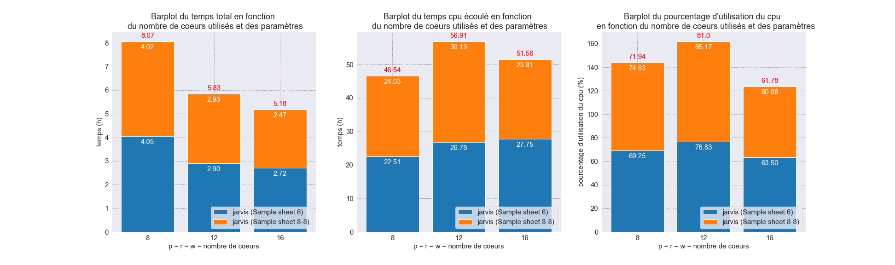

##  8. Comparaison bcl2fastq et bcl-convert
###  8.1. Comparaison du temps total
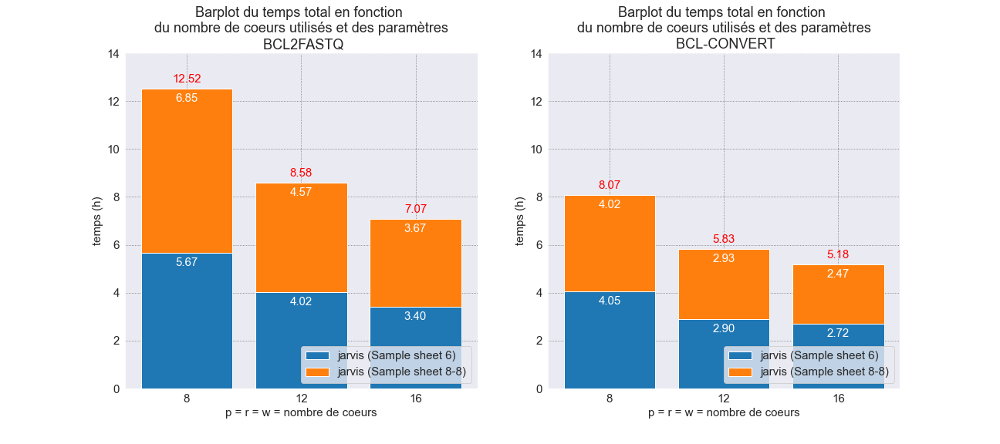

###  8.2. Comparaison du tems cpu
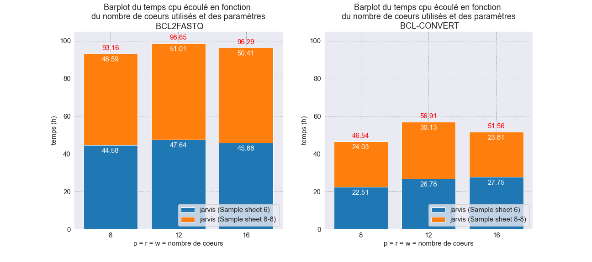

###  8.3. Comparaison du pourcentage d'utilisation des cpu
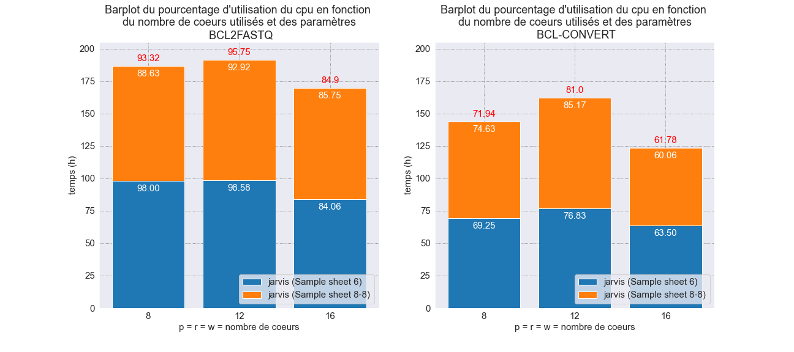

###  8.4. Tableau comparatif entre bcl2fastq et bcl-convert

|   |temps total (h)|   |temps cpu (h)|   |Utilisation cpu (%)|   |
|---|---|---|---|---|---|---|
|paramètres|bcl2fasq|bcl-convert|bcl2fasq|bcl-convert|bcl2fasq|bcl-convert|
|r8 p8 w8 #coeurs 8|12.52|8.07|93.16|46.54|93.23|71.94|
|r12 p12 w12 #coeurs 12|8.58|5.83|98.65|56.91|95.75|81.00|
|r16 p16 w16 #coeurs 16|7.07|5.18|96.29|51.56|84.90|61.78|

##  9. Comparaison des performance en utilisant le paramètre du nombre de tâches en paralèlles

###  9.1. Tableau

###  9.2. Graphiques
####  9.2.1. p = w = r = nb de coeurs

####  9.2.2. P = nb de coeurs et r = w = 4
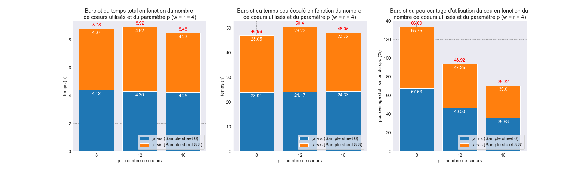

###  9.3. utilisation du nombre de tâches à effectuer en paralèlles

##  10. Différences d'arborescence entre bcl2fastq et bcl-convert
###  10.1. Commande pour lancé bcl2fastq

jobify -c <nombre de cœur (8, 12 ou 16)> -p <partition (production)> -t <D:HH:MM:SS> -b -w <noeud (pas obligatoire)> 'bcl2fastq --input-dir <path du répertoire du run contenant les Bases Calling> --min-log-level WARNING --barcode-mismatches <nombre de missmatch autorisé> --sample-sheet <path de la sample sheet> --runfolder-dir <path du répertoire du run> --output-dir <répertoire de sortie du démultiplexage (le créé s'il n'existe pas)> -r <nombre de threads pour la décompression/lecture> -p <nombre de threads pour la convertion> -w <nombre de threads pour l'écriture/compression> --use-bases-mask <mask à utilisé pour les index (Y*,I12,Y*)>' &

###  10.2. Exemple d'arborescence de bcl2fastq

bcl2fastq  
├── Project_1  
│   ├── Sample_12BA131_1  
│   │   ├── 12BA131_S3_L001_R1_001.fastq.gz  
│   │   └── 12BA131_S3_L001_R2_001.fastq.gz  
│   ├── Sample_12BA132_1  
│   │   ├── 12BA132_S6_L001_R1_001.fastq.gz  
│   │   └── 12BA132_S6_L001_R2_001.fastq.gz  
│   ├── Sample_12BA133_1  
│   │   ├── 12BA133_S1_L001_R1_001.fastq.gz  
│   │   └── 12BA133_S1_L001_R2_001.fastq.gz  
│   ├── Sample_12BA134_1  
│   │   ├── 12BA134_S2_L001_R1_001.fastq.gz  
│   │   └── 12BA134_S2_L001_R2_001.fastq.gz  
│   ├── Sample_12BA135_1  
│   │   ├── 12BA135_S5_L001_R1_001.fastq.gz  
│   │   └── 12BA135_S5_L001_R2_001.fastq.gz  
│   └── Sample_12BA136_1  
│       ├── 12BA136_S4_L001_R1_001.fastq.gz  
│       └── 12BA136_S4_L001_R2_001.fastq.gz  
├── Reports  
│   └── html  
│       ├── 000000000-DDL9H  
│       │   ├── all  
│       │   │   └── all  
│       │   │       ├── all  
│       │   │       │   ├── laneBarcode.html  
│       │   │       │   └── lane.html  
│       │   │       └── unknown  
│       │   ├── default  
│       │   │   ├── all  
│       │   │   │   ├── all  
│       │   │   │   │   ├── laneBarcode.html  
│       │   │   │   │   └── lane.html    
│       │   │   │   └── unknown   
│       │   │   └── Undetermined   
│       │   │       ├── all   
│       │   │       │   ├── laneBarcode.html   
│       │   │       │   └── lane.html  
│       │   │       └── unknown  
│       │   │           ├── laneBarcode.html  
│       │   │           └── lane.html  
│       │   └── Project_1  
│       │       ├── 12BA131  
│       │       │   ├── all  
│       │       │   │   ├── laneBarcode.html  
│       │       │   │   └── lane.html  
│       │       │   ├── GTCGAAGGAGCC  
│       │       │   │   ├── laneBarcode.html  
│       │       │   │   └── lane.html  
│       │       │   └── unknown  
│       │       ├── 12BA132  
│       │       │   ├── AATATGCATCGG  
│       │       │   │   ├── laneBarcode.html  
│       │       │   │   └── lane.html  
│       │       │   ├── all  
│       │       │   │   ├── laneBarcode.html  
│       │       │   │   └── lane.html  
│       │       │   └── unknown  
│       │       ├── 12BA133  
│       │       │   ├── all  
│       │       │   │   ├── laneBarcode.html  
│       │       │   │   └── lane.html  
│       │       │   ├── CAGCTAGGATCC  
│       │       │   │   ├── laneBarcode.html  
│       │       │   │   └── lane.html  
│       │       │   └── unknown  
│       │       ├── 12BA134  
│       │       │   ├── all  
│       │       │   │   ├── laneBarcode.html  
│       │       │   │   └── lane.html  
│       │       │   ├── TGCGCTAATCTT   
│       │       │   │   ├── laneBarcode.html  
│       │       │   │   └── lane.html  
│       │       │   └── unknown  
│       │       ├── 12BA135  
│       │       │   ├── all  
│       │       │   │   ├── laneBarcode.html  
│       │       │   │   └── lane.html  
│       │       │   ├── TTCAGGAGAGCC  
│       │       │   │   ├── laneBarcode.html  
│       │       │   │   └── lane.html  
│       │       │   └── unknown  
│       │       ├── 12BA136  
│       │       │   ├── ACGTAATATCGG  
│       │       │   │   ├── laneBarcode.html  
│       │       │   │   └── lane.html  
│       │       │   ├── all  
│       │       │   │   ├── laneBarcode.html  
│       │       │   │   └── lane.html  
│       │       │   └── unknown  
│       │       └── all  
│       │           ├── all  
│       │           │   ├── laneBarcode.html  
│       │           │   └── lane.html  
│       │           └── unknown  
│       ├── index.html  
│       ├── Report.css  
│       └── tree.html  
├── Stats  
│   ├── AdapterTrimming.txt  
│   ├── ConversionStats.xml  
│   ├── DemultiplexingStats.xml  
│   ├── DemuxSummaryF1L1.txt  
│   ├── FastqSummaryF1L1.txt  
│   └── Stats.json  
├── Undetermined_S0_L001_R1_001.fastq.gz  
└── Undetermined_S0_L001_R2_001.fastq.gz  

###  10.3. Commande de bcl-convert
jobify -c <nombre de cœur (8, 12 ou 16)> -p <partition (production)> -t <D:HH:MM:SS> -b -w <noeud (pas obligatoire)> 'bcl-convert --bcl-input-directory <path du répertoire du run> --output-directory <path du répertoire de sortie du démultiplexage (ne doit pas déja existé sinon kill l'execution)> --sample-sheet  <path de la sample sheet (obligatoire)> --bcl-sampleproject-subdirectories true --bcl-num-parallel-tiles 1 --bcl-num-compression-threads <nombre de threads pour la décompression/lecture> --bcl-num-conversion-threads <nombre de threads pour la convertion> --bcl-num-decompression-threads <nombre de threads pour l'écriture/compression>' &

###  10.4. exemple d'arborescence de bcl-convert

bcl-convert  
├── Logs  
│   ├── Errors.log  
│   ├── FastqComplete.txt  
│   ├── Info.log  
│   └── Warnings.log  
├── Project_1  
│   ├── 12BA131_S3_L001_R1_001.fastq.gz  
│   ├── 12BA131_S3_L001_R2_001.fastq.gz  
│   ├── 12BA132_S6_L001_R1_001.fastq.gz  
│   ├── 12BA132_S6_L001_R2_001.fastq.gz  
│   ├── 12BA133_S1_L001_R1_001.fastq.gz  
│   ├── 12BA133_S1_L001_R2_001.fastq.gz  
│   ├── 12BA134_S2_L001_R1_001.fastq.gz  
│   ├── 12BA134_S2_L001_R2_001.fastq.gz  
│   ├── 12BA135_S5_L001_R1_001.fastq.gz  
│   ├── 12BA135_S5_L001_R2_001.fastq.gz  
│   ├── 12BA136_S4_L001_R1_001.fastq.gz  
│   └── 12BA136_S4_L001_R2_001.fastq.gz  
├── Reports  
│   ├── Adapter_Metrics.csv  
│   ├── Demultiplex_Stats.csv  
│   ├── fastq_list.csv  
│   ├── Index_Hopping_Counts.csv  
│   ├── IndexMetricsOut.bin  
│   ├── Quality_Metrics.csv  
│   ├── RunInfo.xml  
│   ├── SampleSheet.csv  
│   └── Top_Unknown_Barcodes.csv  
├── Undetermined_S0_L001_R1_001.fastq.gz  
└── Undetermined_S0_L001_R2_001.fastq.gz  

##  11. Description des sorties de bcl-convert

- Répertoire `logs` ==> contient les différents log
	- `Errors.log` ==> log des erreurs qu'il y a eu lors l'execution
	- `FastqComplete.txt` ==> Contient la version utilisé de bcl-convert et la date et l'heure de fin d'excution de bcl-convert
	- `Info.log` ==> Contient les information sur l'execution de bcl-convert
		- les réglages de la partie settings de la sample sheet
		- les info sur la version de bcl-convert et les options désactivés, le copyright
		- la ligne de commande lancé pour executer bcl-convert
		- les information à propos des cpu utilisés (le nombre de cpu dispo sur le neud, le nombre de cpu utilisés, le nombre de cpu utilisé pour la décompression et la compression)
		- indique si la converssion est complétée ou non  
	- `Warnings.log` ==> contient tous les warrnings détecter lors de l'execution
- Répertoire `Project_1` ==> contient les fastq du projet 1  (Attention ne trie pas par échantillons)
- Répertoire `Reports` ==> contient les fichiers de statistiques, des métriques et la liste des échantillons
	- `Adapter_Metrics.csv` ==> contient les informations à propos des adaptateurs
		- $1^{er}$ colonne {Lane} : numéro de la _Lane_ 
		- $2^{éme}$ colonne {Sample_ID} : ID de l'échantillon 
		- $3^{éme}$ colonne {index} : index 1 
		- $4^{éme}$ colonne {index2} : index 2 
		- $5^{éme}$ colonne {ReadNumber} : numéro du read 1 ou 2 (forward ou reverse) 
		- $6^{éme}$ colonne {AdapterBases} : nombre de base provenant des adapteurs 
		- $7^{éme}$ colonne {SampleBases} : nombre de base provenant de l'échantillon 
		- $8^{éme}$ colonne {% Adapter Bases} : pourcentage de bases provenant des adaptateurs 
	- `Demultiplex_Stats.csv` ==> contient les informations à propos du demultiplexage
		- $1^{er}$ colonne {Lane} : numéro de la _Lane_ 
		- $2^{éme}$ colonne {SampleID} : ID de l'échantillon
		- $3^{éme}$ colonne {Index} : séquence de l'index
		- $4^{éme}$ colonne {# Reads} : nombre de reads de l'échantillon
		- $5^{éme}$ colonne {# Perfect Index Reads} : nombre de reads sans miss match
		- $6^{éme}$ colonne {# One Mismatch Index Reads} : nombre de reads avec un missmatch
		- $7^{éme}$ colonne {# Two Mismatch Index Reads} : nombre de reads avec deux missmatch
		- $8^{éme}$ colonne {% Reads} : pourcentage de reads appartenant à cette échantillon
		- $9^{éme}$ colonne {% Perfect Index Reads} : pourcentage de reads sans missmatch
		- $10^{éme}$ colonne {% One Mismatch Index Reads} : pourcentage de reads avec un missmatch
		- $11^{éme}$ colonne {% Two Mismatch Index Reads} : pourcentage de reads avec deux missmatch
	- `fastq_list.csv` ==> contient les informations des echantillons et de leurs reads
		- $1^{er}$ colonne {RGID} : ID de l'index
		- $2^{éme}$ colonne {RGSM} : ID de l'échantillon
		- $3^{éme}$ colonne {RGLB} : librairie inconnue
		- $4^{éme}$ colonne {Lane} : numéro de la _Lane_ 
		- $5^{éme}$ colonne {Read1File} : path vers le fichier fastq du read 1 (forward) de l'échantillon
		- $6^{éme}$ colonne {Read2File} : path vers le fichier fastq du read 2 (reverse) de l'échantillon
	- `Index_Hopping_Counts.csv` ==> contient les index hopping "saut d'index" (index fixé au mauvais échantillon). Si l'execution contient aucun ou un seul index, le fichier n'est édité qu'avec l'en-tête.
		- $1^{er}$ colonne {Lane} :numéro de la _Lane_
		- $2^{éme}$ colonne {Sample_ID} : ID de l'échantillon
		- $3^{éme}$ colonne {index} : index 1
		- $4^{éme}$ colonne {index2} : index 2
		- $5^{éme}$ colonne {# Reads} : nombre de reads de l'échantillon
		- $6^{éme}$ colonne {% of Hopped Reads} : pourcentage de reads qui on un "saut d'index"
		- $7^{éme}$ colonne {% of All Reads} : pourcentage total de reads
	- `IndexMetricsOut.bin` ==> fichier de sortie des métriques d'index au format binaire qui contient les statistiques d'index pour chaque combinaison d'échantillons et d'index par _lane_.
	- `Quality_Metrics.csv`==> fichier regroupant les métriques de qualité de chaque échantillons
		- $1^{er}$ colonne {Lane} : numéro de la _Lane_ 
		- $2^{éme}$ colonne {SampleID} : ID de l'échantillon
		- $3^{éme}$ colonne {index} : index 1
		- $4^{éme}$ colonne {index2} : index 2
		- $5^{éme}$ colonne {ReadNumber} : numéro du read 1 ou 2 (forward ou reverse) 
		- $6^{éme}$ colonne {Yield} : rendement (nombre de read de cette échantillon) 
		- $7^{éme}$ colonne {YieldQ30} : rendement supérieur ou égale à une qualité de Q30 (nombre de read de cette échantillon >= Q30) 
		- $8^{éme}$ colonne {QualityScoreSum} : somme de la qualité moyenne de chaque reads
		- $9^{éme}$ colonne {Mean Quality Score (PF)} : moyenne de la qualité des reads de l'échantillon
		- $10^{éme}$ colonne {% Q30} : pourcentage de reads yant une qualité >= à Q30
	- `RunInfo.xml` ==> copie du RunInfo.xml utilisé par bcl-convert
	- `SampleSheet.csv` ==> copie de la smple sheet utilisé par bcl-convert
	- `Top_Unknown_Barcodes.csv`
		- $1^{er}$ colonne {Lane} : numéro de la _Lane_ 
		- $2^{éme}$ colonne {index} : index 1
		- $3^{éme}$ colonne {index2} : index 2
		- $4^{éme}$ colonne {# Reads} : nombre de reads
		- $5^{éme}$ colonne {% of Unknown Barcodes} : pourcentage de barcodes inconnu pour c'est index
		- $6^{éme}$ colonne {% of All Reads} : pourcentage des reads dont le barcodes est inconnus pour ces index.  
- Les fichiers fastq des reads indéterminés

